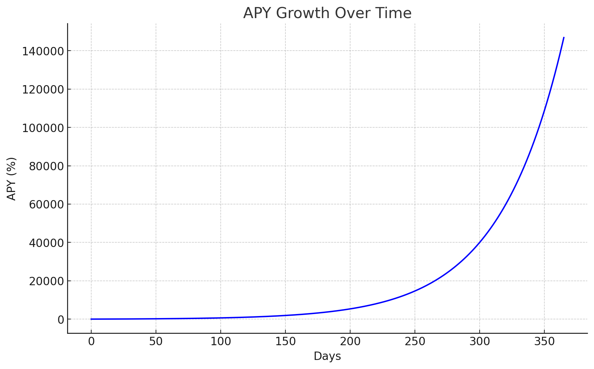

# Eutopia Autostaking Protocol (EASP) Technical Overview

### **Introduction**

Eutopia is set to revolutionize decentralized finance (DeFi) with the Eutopia Autostaking Protocol (EASP). This innovative financial protocol simplifies staking mechanics and ensures Eutopia token holders receive stable returns.

The EASP integrates automatic staking and compounding functionalities, providing the highest fixed Annual Percentage Yield (APY) in the market at <mark style="color:purple;">**146,847.85%**</mark>, equating to a daily Return on Investment (ROI) of <mark style="color:purple;">**2.0181%**</mark>.

Eutopia's auto compounding feature automatically reinvests staking rewards into the pool at regular intervals, maximizing returns through continuous compound interest. This process ensures that Eutopia token holders benefit from exponential growth without manual input, optimizing yield efficiency and simplifying the staking experience.

<figure><figcaption>
APY Growth Over Time
</figcaption></figure>

### **Key Features**

1. **Simplicity and Security:**
   * Autostaking is enabled directly in the user's wallet upon purchasing Eutopia tokens, eliminating the need for off-platform transfers.
   * Upon acquisition of EUTO, tokens are automatically staked, and holders are immediately eligible for rebase rewards.
   * This mechanism represents the simplest autostaking system in the DeFi space.
2. **Consistent APY:**
   * Unlike other DeFi protocols with fluctuating APYs, EASP offers a fixed daily interest rate of <mark style="color:purple;">**2.0181%**</mark>.
   * This fixed rate, when compounded, results in an annual yield of <mark style="color:purple;">**146,847.85%**</mark>, providing predictability and reliability for EUTO holders.
3. **Rapid Rebase Rewards:**
   * EASP distributes rebase rewards every <mark style="color:purple;">**15**</mark> minutes (<mark style="color:purple;">**96**</mark> times per day), making it the fastest autostaking protocol in the cryptocurrency market.
   * This frequency contrasts with other protocols that typically distribute rewards every 8 hours.
4. **Strategic Price and Reward Support:**
   * EASP utilizes game theory and behavioral economics to predict and respond to token holder actions.
   * The protocol's design ensures seamless integration of these predictive mechanisms, maintaining price stability and consistent rebase rewards.
5. **Versatility and Potential:**
   * EASP serves as the backbone for Eutopia's diverse range of products, services, and projects, each designed to transform various aspects of the cryptocurrency ecosystem.

### **Mathematical Formulations**

Eutopia employs a Positive Rebase formula, ensuring daily token distribution proportional to the daily rebase rewards. Each epoch (rebase period) grants <mark style="color:purple;">**2.0181%**</mark> of the total Eutopia tokens held to holders, resulting in an annual compound interest rate of <mark style="color:purple;">**146,847.85%**</mark>. Rebase rewards are distributed without requiring token transfers, maintaining security and convenience for holders.

* **Annual Percentage Yield (APY)**

$$
\text{APY} = \left(1 + \frac{\text{Daily ROI}}{100}\right)^{365} - 1 = 1,468.4785
$$

* **Daily Rebase Calculation**

$$
\text{Reward Epoch} = 900 seconds (15 minutes)
$$

$$
\text{Reward Distribution Count Per Day} = 96
$$

$$
\text{Reward Rate Per Epoch} = 1.0002081456
$$

$$
\text{Reward Rate Per Day} = {Reward Rate Per Epoch}^{Reward Distribution Count Per Day}
$$

$$
\text{Daily ROI} = (\text{Reward Rate Per Day} - 1) \times 100 = 2.0181
$$

| Day | 10,000 EUTO | Reward (10,000 EUTO) | 1,000,000 EUTO | Reward (1,000,000 EUTO) |
| --- | ----------- | -------------------- | -------------- | ----------------------- |
| 1   | 10,201.81   | 201.81               | 1,020,181.46   | 20,181.46               |
| 2   | 10,408.36   | 408.36               | 1,040,836.43   | 40,836.43               |
| 3   | 10,618.14   | 618.14               | 1,061,814.42   | 61,814.42               |
| 4   | 10,831.27   | 831.27               | 1,083,127.19   | 83,127.19               |
| 5   | 11,047.86   | 1,047.86             | 1,104,786.45   | 104,786.45              |
| 6   | 11,268.02   | 1,268.02             | 1,126,801.85   | 126,801.85              |
| 7   | 11,491.88   | 1,491.88             | 1,149,187.76   | 149,187.76              |
| 8   | 11,719.56   | 1,719.56             | 1,171,955.85   | 171,955.85              |
| 9   | 11,951.18   | 1,951.18             | 1,195,118.17   | 195,118.17              |
| 10  | 12,186.86   | 2,186.86             | 1,218,686.43   | 218,686.43              |
| 11  | 12,426.75   | 2,426.75             | 1,242,675.01   | 242,675.01              |
| 12  | 12,671.01   | 2,671.01             | 1,267,101.01   | 267,101.01              |
| 13  | 12,919.75   | 2,919.75             | 1,291,975.02   | 291,975.02              |
| 14  | 13,173.12   | 3,173.12             | 1,317,312.48   | 317,312.48              |
| 15  | 13,431.26   | 3,431.26             | 1,343,125.71   | 343,125.71              |
| 16  | 13,694.30   | 3,694.30             | 1,369,430.12   | 369,430.12              |
| 17  | 13,962.41   | 3,962.41             | 1,396,241.10   | 396,241.10              |
| 18  | 14,235.72   | 4,235.72             | 1,423,571.24   | 423,571.24              |
| 19  | 14,514.40   | 4,514.40             | 1,451,440.16   | 451,440.16              |
| 20  | 14,798.59   | 4,798.59             | 1,479,858.70   | 479,858.70              |
| 21  | 15,088.44   | 5,088.44             | 1,508,844.87   | 508,844.87              |
| 22  | 15,384.12   | 5,384.12             | 1,538,412.77   | 538,412.77              |
| 23  | 15,685.78   | 5,685.78             | 1,568,578.70   | 568,578.70              |
| 24  | 15,993.57   | 5,993.57             | 1,599,357.17   | 599,357.17              |
| 25  | 16,307.69   | 6,307.69             | 1,630,769.95   | 630,769.95              |
| 26  | 16,628.27   | 6,628.27             | 1,662,827.95   | 662,827.95              |
| 27  | 16,955.51   | 6,955.51             | 1,695,551.35   | 695,551.35              |
| 28  | 17,289.57   | 7,289.57             | 1,728,957.59   | 728,957.59              |
| 29  | 17,630.63   | 7,630.63             | 1,763,063.31   | 763,063.31              |
| 30  | 17,978.85   | 7,978.85             | 1,797,884.47   | 797,884.47              |

The Eutopia Autostaking Protocol (EASP) is designed to provide EUTO holders with a secure, reliable, and high-yielding staking experience, leveraging advanced mathematical models and economic theories to ensure optimal performance and stability.
